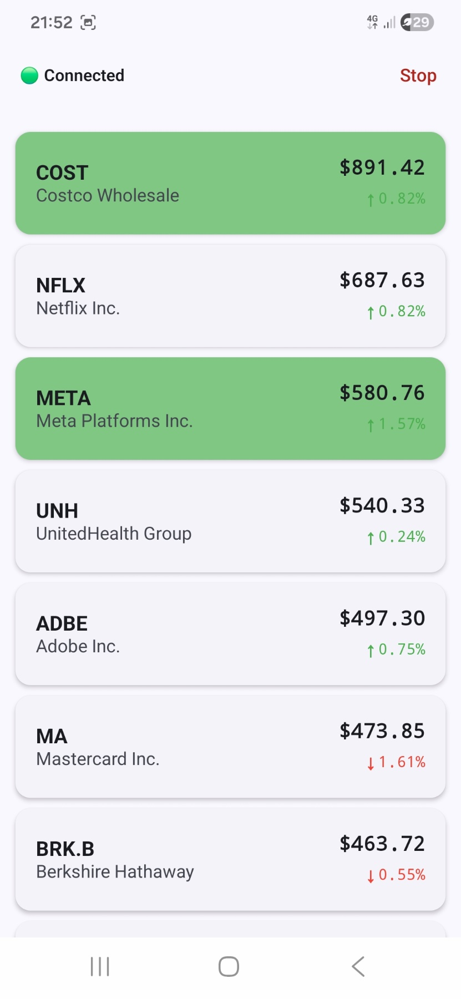
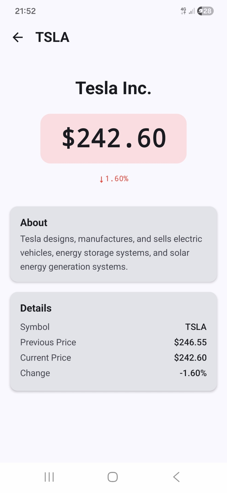
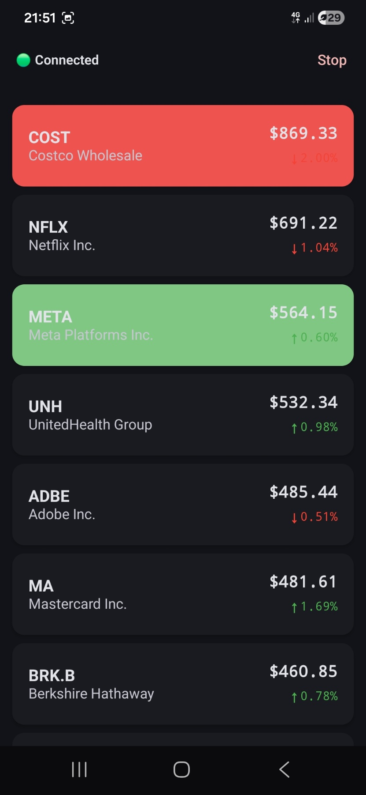
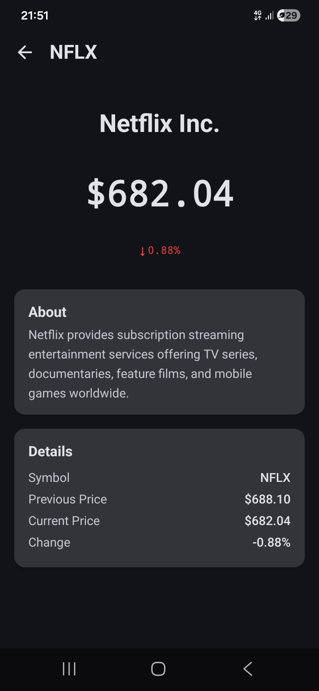

# Real-Time Price Tracker

An Android app built with Jetpack Compose that displays real-time price updates for 25 stock symbols using WebSocket communication.

## Screenshots

### Light Theme
| Feed Screen | Details Screen |
|:-----------:|:--------------:|
|  |  |

### Dark Theme
| Feed Screen | Details Screen |
|:-----------:|:--------------:|
|  |  |

## Features

- **Live price tracking** for 25 stock symbols (AAPL, GOOG, TSLA, AMZN, MSFT, NVDA, META, etc.)
- **WebSocket integration** via `wss://ws.postman-echo.com/raw` — sends random price updates every 2 seconds and receives echoed responses
- **Real-time feed** with LazyColumn, sorted by price (highest first), with green/red change indicators
- **Symbol details screen** showing current price, change percentage, company description, and detailed price info
- **Connection status indicator** (green = connected, red = disconnected) and Start/Stop toggle in the top bar
- **Price flash animations** — items flash green on price increase and red on price decrease
- **Deep linking** — `stocks://symbol/{symbol}` opens the details screen directly
- **Light & Dark theme** support with Material3 dynamic colors (Android 12+)

## Architecture

The project follows **Clean Architecture** with **MVVM** pattern:

```
app/
├── core/
│   ├── common/          # Shared models (ConnectionStatus)
│   ├── data/            # WebSocket, local data source, price simulator, parsers
│   ├── domain/model/    # Domain entities (StockPrice, PriceDirection)
│   ├── designsystem/    # Theme, colors, typography, components
│   └── navigation/      # NavHost, Route definitions
├── feature/
│   ├── feed/            # Feed screen (presentation, domain, data)
│   └── details/         # Details screen (presentation, domain, data)
└── di/                  # Hilt dependency injection modules
```

Each feature module is split into three layers:
- **Presentation** — Compose screens, ViewModels, UI state, mappers
- **Domain** — Use cases, repository interfaces
- **Data** — Repository implementations

## Technical Decisions

### WebSocket Lifecycle via MainViewModel

The WebSocket connection is owned and controlled by `MainViewModel`, which is scoped to `MainActivity`. This means the connection lives for the entire duration of the app and survives configuration changes (e.g. screen rotation). The Start/Stop toggle in the top bar calls `MainViewModel.toggleRunning()`, which launches or cancels a coroutine `Job` in `viewModelScope`. Both the Feed and Details screens observe the same shared data streams without creating duplicate connections — `FeedViewModel` and `DetailsViewModel` simply collect from the local data source that `MainViewModel`'s connection populates.

### Thread-Safe WebSocket Management with AtomicReference

`WebSocketDataSource` uses `AtomicReference<WebSocket?>` to hold the current OkHttp WebSocket instance. This is necessary because WebSocket callbacks (`onOpen`, `onMessage`, `onFailure`, etc.) are invoked on OkHttp's dispatcher thread, while connect/disconnect/send can be called from coroutine threads. `AtomicReference` provides lock-free thread-safe access:
- `getAndSet(null)` atomically clears the socket on disconnect/reconnect, preventing double-close
- Identity checks (`ws !== webSocket.get()`) in callbacks ensure stale callbacks from a previous socket are ignored

### Immutable UI State

All UI state classes are sealed interfaces annotated with `@Immutable`, ensuring Compose can skip recomposition when state hasn't changed. ViewModels expose `StateFlow` and never mutate state directly — new state objects are emitted on every update.

## Tech Stack

- **Kotlin** + **Coroutines** + **Flow**
- **Jetpack Compose** — 100% declarative UI
- **Navigation Compose** — NavHost with typed routes and deep link support
- **Hilt** — Dependency injection
- **OkHttp** — WebSocket client
- **StateFlow** — Reactive UI state management with `@Immutable` state classes
- **SavedStateHandle** — Preserving selected symbol across process death
- **Material3** — Theming with dynamic color support

## Testing

The project includes **45+ unit tests** covering:

- **Use cases** — `ConnectStockFeedUseCase`, `ObserveStockFeedUseCase`, `ObserveConnectionStatusUseCase`, `ObserveStockDetailUseCase`
- **Mappers** — `StockPriceMapper`, `FeedStockUiMapper`, `DetailStockUiMapper`
- **Data sources** — `StocksLocalDataSourceImpl` (initial state, price updates, observation)
- **Parsers** — `PriceUpdateParser` (valid/invalid JSON, edge cases)

**Libraries:** JUnit4, MockK, Turbine, kotlinx-coroutines-test

Run tests:
```bash
./gradlew test
```

### Code Coverage (JaCoCo)

The project is configured with JaCoCo for code coverage reporting. To generate the coverage report:

```bash
./gradlew jacocoTestReport
```

The HTML report is generated at `app/build/reports/jacoco/jacocoTestReport/html/index.html`.

JaCoCo is configured to exclude generated code (Hilt, Dagger, Compose singletons), UI components, DI modules, and Activity/Application classes — focusing coverage metrics on business logic: **use cases, mappers, parsers, and local data sources**.

## Deep Linking

The app registers a custom URI scheme `stocks://symbol/{symbol}` that navigates directly to the details screen for a given stock symbol.

**How it works:**
- `AndroidManifest.xml` declares an intent filter for the `stocks` scheme with host `symbol`
- Navigation Compose uses `navDeepLink<Route.Details>` to map the URI to the Details destination
- `MainActivity` forwards the incoming intent to `NavController.handleDeepLink()`

**Testing via ADB** (with the app installed on a device/emulator):

```bash
# Open AAPL details screen
adb shell am start -a android.intent.action.VIEW -d "stocks://symbol/AAPL"

# Open TSLA details screen
adb shell am start -a android.intent.action.VIEW -d "stocks://symbol/TSLA"

# Works with any of the 25 supported symbols
adb shell am start -a android.intent.action.VIEW -d "stocks://symbol/NVDA"
```

This works whether the app is already running or cold-started.

## Build & Run

1. Clone the repository
2. Open in Android Studio (Hedgehog or newer)
3. Sync Gradle and run on a device/emulator (API 24+)
